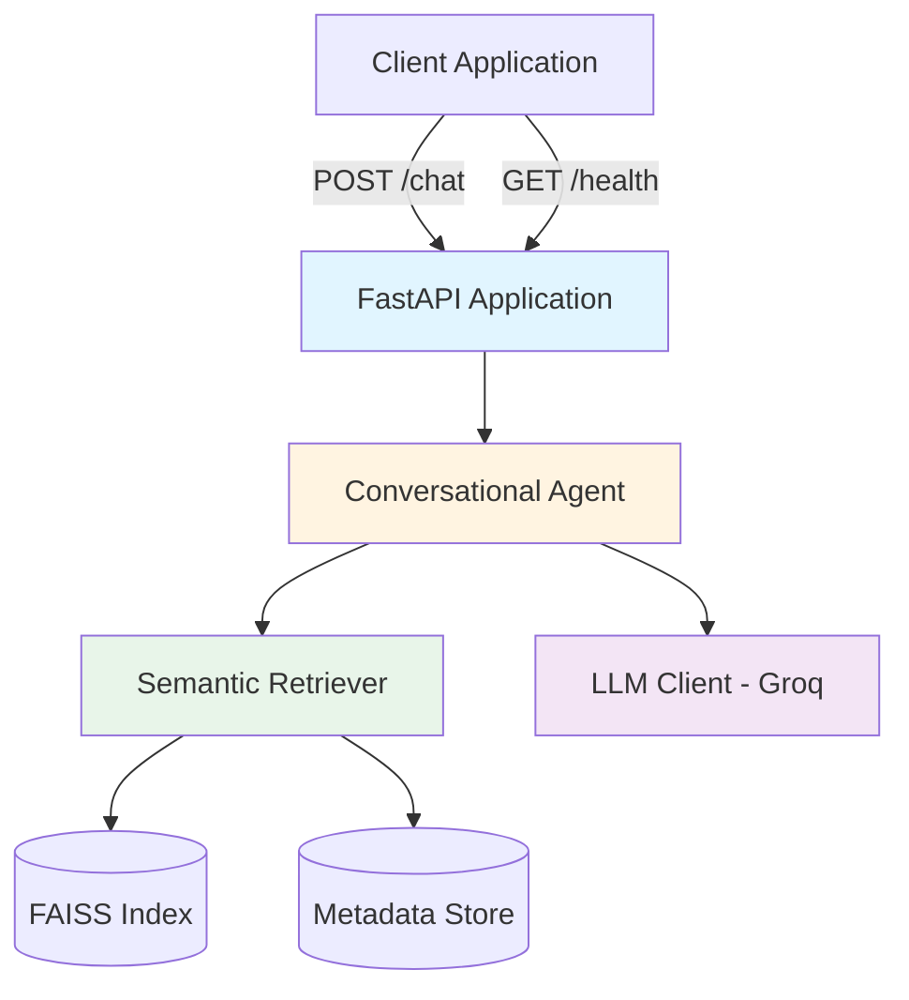

# Design Document: SHL Assessment Recommender

## Overview

The SHL Assessment Recommender is a stateless conversational API that helps hiring managers discover relevant SHL Individual Test Solutions through natural language interaction. The system combines semantic search over a scraped product catalog with LLM-powered conversation management to provide grounded, evidence-based recommendations.

### Core Design Principles

1. **Stateless Architecture**: Each request contains complete conversation history; no server-side session storage
2. **Grounded Responses**: All recommendations must be backed by retrieved catalog evidence
3. **Semantic Retrieval**: Use embedding-based similarity search for flexible query matching
4. **Hybrid Ranking**: Combine semantic similarity with keyword overlap for improved relevance
5. **Defensive Design**: Validate URLs, resist prompt injection, refuse off-topic requests

### Key Technical Decisions

- **FastAPI Framework**: Chosen for async support, automatic OpenAPI documentation, and Pydantic validation
- **FAISS Vector Store**: Selected for efficient in-memory similarity search without external database dependencies
- **Sentence Transformers**: Using `all-MiniLM-L6-v2` model for balance between quality and speed (384-dimensional embeddings)
- **Groq API with Llama 3.3 70B**: Provides fast inference (750+ tokens/sec) with strong instruction-following capabilities
- **Temperature 0.1**: Low temperature for deterministic, focused responses while maintaining natural language quality

## Architecture

### System Components



### Data Flow

#### Request Processing Flow

```mermaid
sequenceDiagram
    participant C as Client
    participant API as FastAPI
    participant A as Agent
    participant R as Retriever
    participant L as LLM
    
    C->>API: POST /chat {messages: [...]}
    API->>API: Validate schema
    API->>A: process_conversation(messages)
    
    A->>A: Detect intent
    
    alt Off-topic request
        A->>API: {reply, recommendations: [], end: true}
    else Clarification needed
        A->>R: retrieve(query, k=20)
        R->>A: candidates
        A->>L: generate_clarification(history, candidates)
        L->>A: clarifying_question
        A->>API: {reply, recommendations: [], end: false}
    else Recommendation
        A->>R: retrieve(query, filters, k=20)
        R->>A: candidates
        A->>A: re_rank(candidates, query)
        A->>A: select_top_n(1-10)
        A->>L: generate_response(history, selected)
        L->>A: response_text
        A->>A: validate_urls(selected)
        A->>API: {reply, recommendations: [...], end: false}
    else Comparison
        A->>R: retrieve_by_names(names)
        R->>A: assessments
        A->>L: generate_comparison(history, assessments)
        L->>A: comparison_text
        A->>API: {reply, recommendations: [], end: false}
    end
    
    API->>C: JSON response
